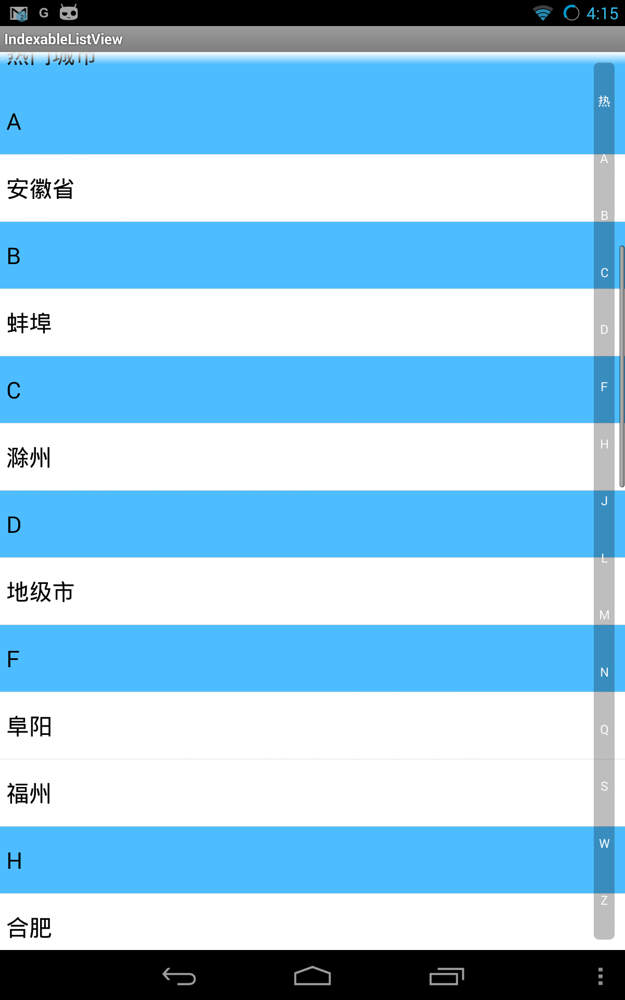

#IndexableListView
Implement `TableView` in iphone on android. Add indexer to 'ListView'. When user touch the alphabet on the scroller, it will jump the correspond position of the list view.

#Usage
- install [maven](http://maven.apache.org/).
- run following command on the root directory of this project. `mvn install && cd indexablelistview-sample && mvn install android:redeploy android:run".

#ScreenShot

